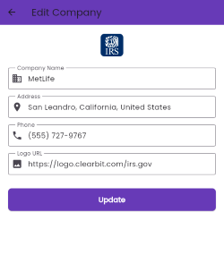

# REST API integration with Dio

Flutter application for managing company information with full CRUD (Create, Read, Update, Delete) operations and search functionality.

## API Integration

The app integrates with a REST API to perform all operations:

- **GET** `/QCIfDy/company` - Fetch all companies
- **POST** `/QCIfDy/company` - Create new company
- **PUT** `/QCIfDy/company/{id}` - Update company
- **DELETE** `/QCIfDy/company/{id}` - Delete company
- **GET** `/QCIfDy/company?company_name=value` - Search companies

## Screenshots

